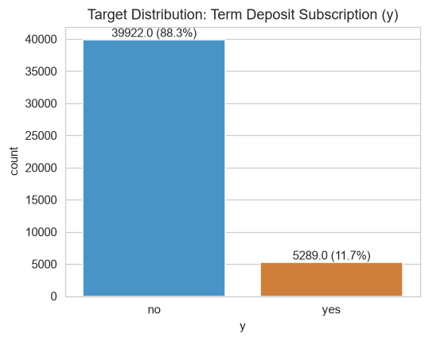
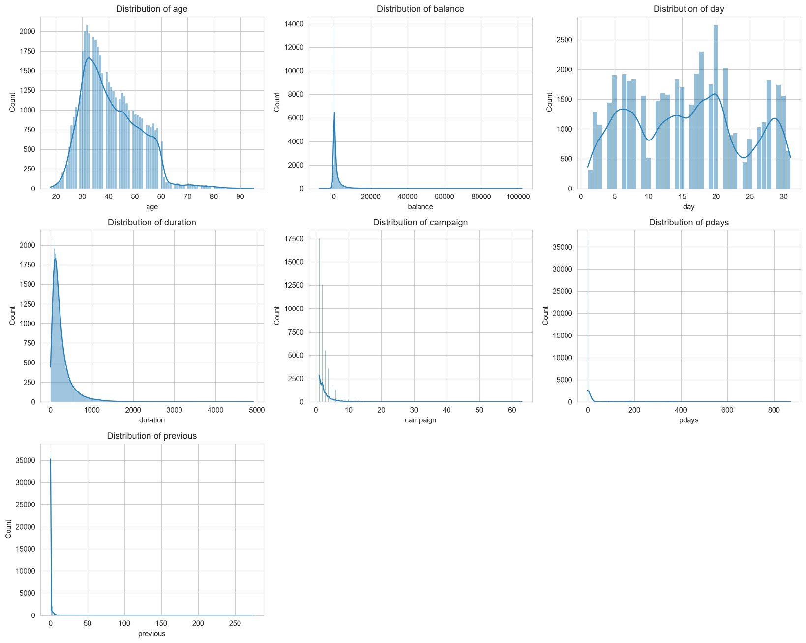
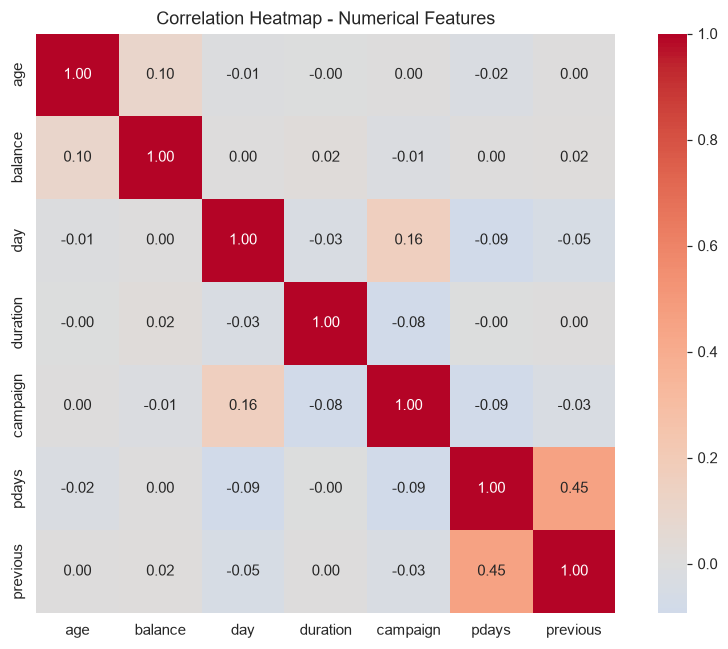
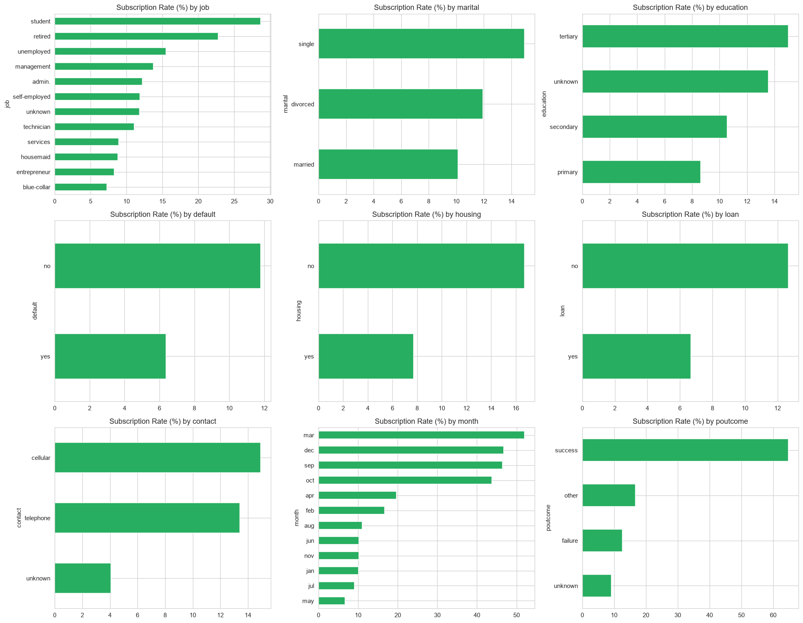
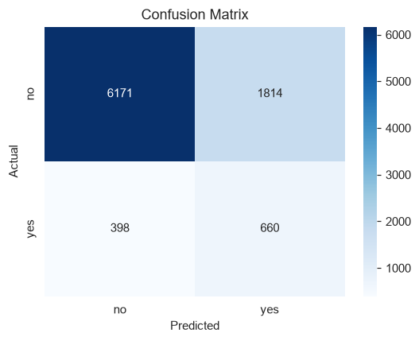
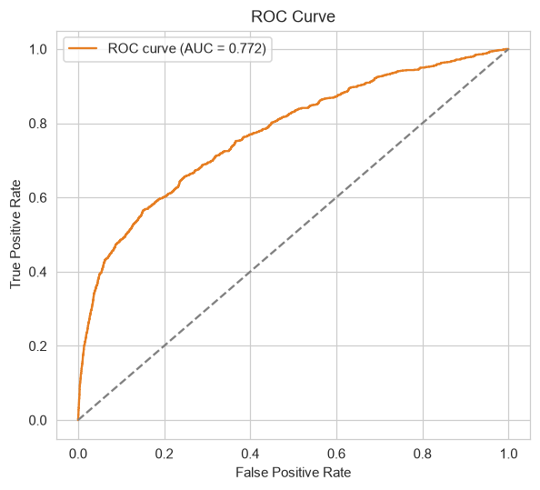
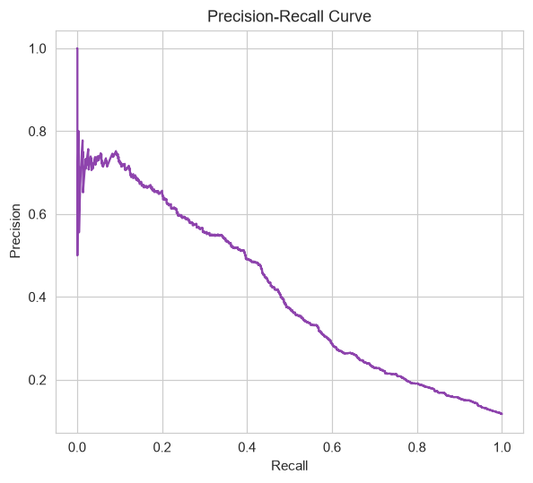
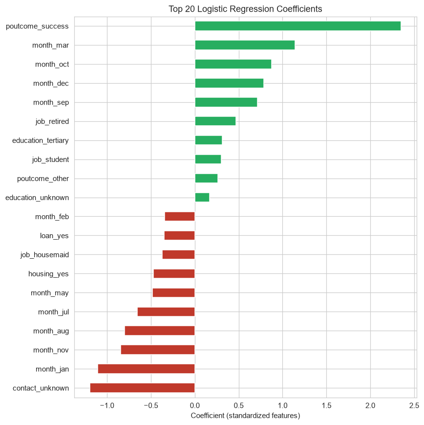

# Problem 2 — Bank Marketing: Term Deposit Subscription Prediction

## Problem Statement
A banking institution wants to predict whether a customer will subscribe to a **term deposit**, based on their banking behaviour, using a **Logistic Regression** model. The dataset (`bank-full.csv`) is the UCI **Bank Marketing Data Set**: 45,211 customers, 16 features (demographics, account details, campaign contact info) + target `y` (`yes`/`no`).

## Repository Contents
| File | Description |
|---|---|
| `bank.py` | End-to-end script: EDA → preprocessing → Logistic Regression → evaluation |
| `bank-full.csv` | Source dataset |
| `eda_summary.txt` | Summary of the EDA results |
| `model_report.txt` | Logistic Regression model evaluation results |
| `images/` | All EDA and evaluation plots |

## How to Run
```bash
pip install pandas numpy matplotlib seaborn scikit-learn
python bank.py
```

---

## 1. Approach & Methodology

### 1.1 Exploratory Data Analysis
- **No missing values** (0 nulls), but `job`, `education`, `contact`, and `poutcome` use `"unknown"` as a placeholder category — kept as its own level rather than imputed, since it may itself be informative (e.g. "no contact history").
- **Target is imbalanced**: ~88.3% `no` vs ~11.7% `yes`.
- Numeric features (`balance`, `campaign`, `previous`, `pdays`) are heavily right-skewed with outliers; `age` is roughly bell-shaped.
- Numeric features have **low intercorrelation** → multicollinearity is not a major concern for Logistic Regression.






### 1.2 Preprocessing
- **Dropped `duration`.** This is a deliberate methodological choice: `duration` (last-call length) is only known *after* the call ends, so including it would leak future information and make the model unusable for real, pre-call prediction — even though it's the single strongest correlate of `y` in the raw data.
- **One-hot encoded** all categorical columns (`job`, `marital`, `education`, `default`, `housing`, `loan`, `contact`, `month`, `poutcome`), dropping the first level to avoid the dummy-variable trap.
- **Standardized** numeric columns (`age`, `balance`, `day`, `campaign`, `pdays`, `previous`) with `StandardScaler`, fit on train only.
- **Stratified 80/20 train/test split** to preserve the class ratio in both sets.

### 1.3 Model
- **Logistic Regression** (`scikit-learn`), `class_weight="balanced"` to compensate for the ~88/12 class imbalance (without this, the model would trivially predict "no" for almost everyone).
- `max_iter=2000` to ensure convergence with the expanded one-hot feature space (41 features after encoding).

---

## 2. Results

| Metric | Value |
|---|---|
| Accuracy | 0.76 |
| Precision (yes) | 0.27 |
| Recall (yes) | 0.62 |
| F1 (yes) | 0.37 |
| ROC-AUC | 0.77 |

Confusion matrix (test set, n=9,043):

|  | Predicted No | Predicted Yes |
|---|---|---|
| **Actual No** | 6,171 | 1,814 |
| **Actual Yes** | 398 | 660 |





### Feature Importance (standardized coefficients)


**Strongest positive drivers of subscription:**
- `poutcome_success` (client subscribed in a previous campaign) — by far the strongest signal.
- `month_mar`, `month_oct`, `month_dec`, `month_sep` — campaigns run in these months convert much better than the high-volume month of May.
- `education_tertiary`, `job_retired`, `job_student` — these segments subscribe at higher rates.

**Strongest negative drivers:**
- `contact_unknown` (contact method not recorded) and `housing_yes` (has a housing loan).
- `month_jan`, `month_nov`, `month_aug`, `month_jul` — lower-converting months.

---

## 3. Findings & Business Recommendations

1. **Accuracy is misleading on this imbalanced dataset.** With `class_weight="balanced"`, the model trades some overall accuracy for much better recall on the minority (`yes`) class — recall of 0.62 means it correctly flags 62% of customers who would actually subscribe, which is far more useful to a marketing team than a model that just predicts "no" for everyone (which would hit ~88% accuracy but 0% recall on subscribers).
2. **Precision (0.27) is low** — of customers flagged as likely subscribers, only ~27% actually subscribe. For a real campaign this is still valuable: it lets the bank prioritize outreach to a much smaller, higher-yield pool than contacting everyone. The precision/recall trade-off can be tuned via the classification threshold depending on call-center capacity.
3. **Timing matters.** Campaigns in March, September, October, and December convert substantially better than the high-volume month of May — worth investigating for future campaign scheduling.
4. **Prior campaign success is the single best predictor** available before a call — customers who converted before are very likely to convert again.
5. **`duration` was intentionally excluded** to keep the model realistic for pre-call scoring; a separate "post-call" model including `duration` could be built for call-quality analysis, but should not be used to decide who to call.
6. **Next steps:** try regularization tuning (L1 for feature selection), threshold tuning against business cost of false positives/negatives, and comparing against tree-based models (Random Forest / Gradient Boosting) as a benchmark for Logistic Regression's performance ceiling.
