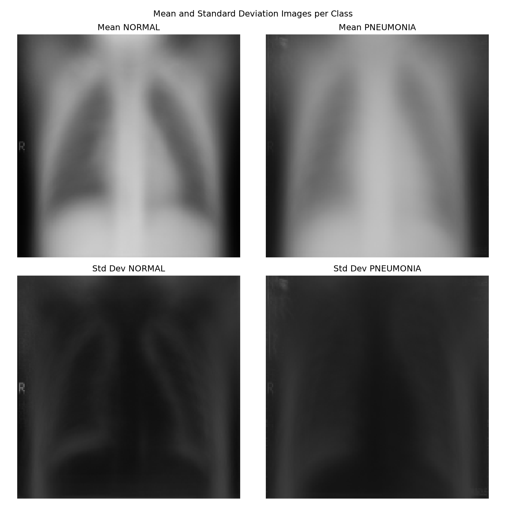
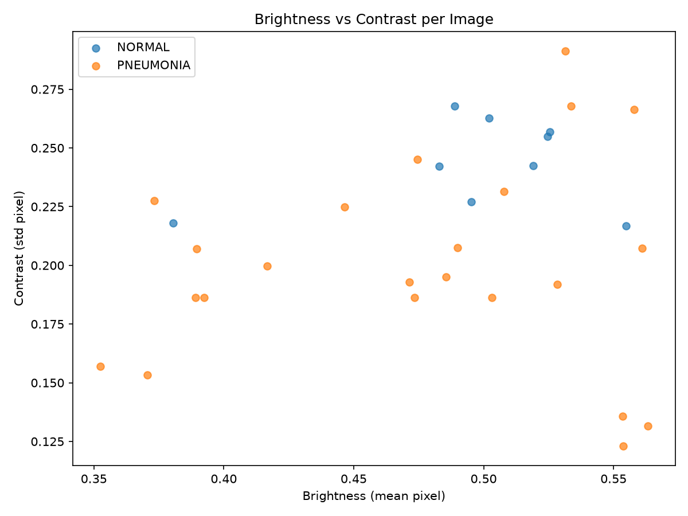
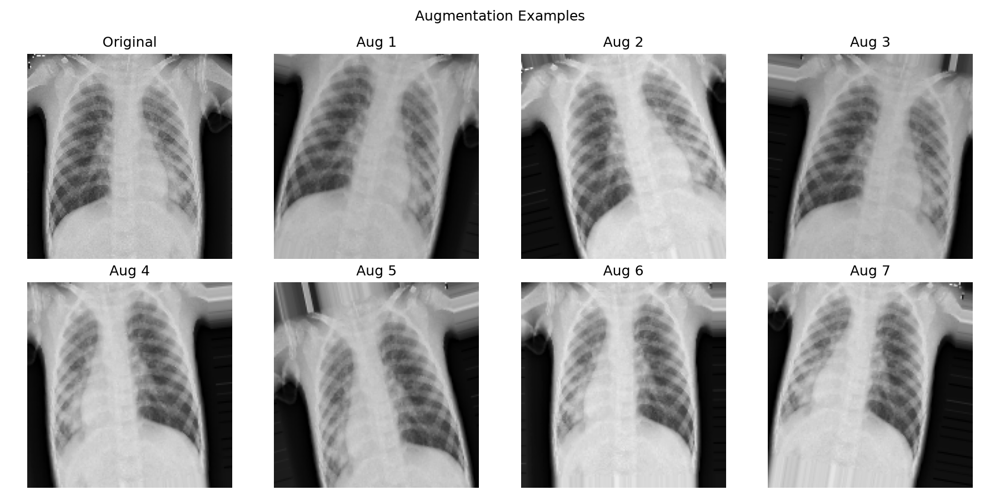
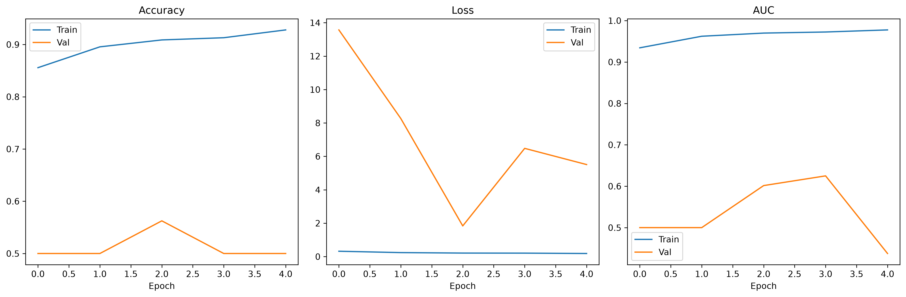

# Problem Set 01 — Pneumonia Detection from Chest X-Rays (CNN)

Classifying paediatric chest X-ray images as **NORMAL** or **PNEUMONIA** using a
convolutional neural network built in TensorFlow/Keras.

---

## 1. Problem Statement

The dataset contains 5,863 JPEG chest X-ray images (anterior-posterior view) from
paediatric patients aged 1–5 years, collected during routine clinical care. Images are
organised into `train`, `test`, and `val` folders, each with `NORMAL` and `PNEUMONIA`
subfolders. The goal is to build a CNN that classifies an X-ray image into the correct
category.

## 2. Repository Structure

```
Pneumonia Detection/
├── x-ray.ipynb          # Full notebook: EDA, model, training, evaluation
├── output/               # All generated plots + saved model
│   ├── class_distribution.png
│   ├── sample_images.png
│   ├── pixel_histograms.png
│   ├── mean_std_images.png
│   ├── brightness_contrast.png
│   ├── augmented_samples.png
│   ├── training_curves.png
│   └── chest_xray_cnn_best.keras
└── README.md
```

## 3. Dataset & Setup

The dataset is expected in `train/`, `val/`, `test/` folders, each containing
`NORMAL/` and `PNEUMONIA/` subfolders. 

The local dataset path is specified in the notebook using the DATA_DIR variable. Before running the notebook, update this variable according to the local dataset location.

```bash
export CHEST_XRAY_DATA_DIR=/path/to/chest_xray
jupyter notebook x-ray.ipynb
```

Images are resized to **150×150**, batch size **32**.

---

## 4. Exploratory Data Analysis (EDA)

### 4.1 Class Distribution

The classes are imbalanced across all three splits, with PNEUMONIA over-represented in
`train` and `test`, while `val` is small and perfectly balanced (only 16 images).


### 4.2 Sample Images

A visual comparison of NORMAL vs PNEUMONIA X-rays. PNEUMONIA cases typically show
denser, hazier lung fields (opacities) compared to the clearer lung fields of NORMAL
cases.


### 4.3 Pixel Intensity Histograms

Distribution of pixel intensities per class, used to check for systematic brightness/
contrast differences between classes that the model might exploit or need to be robust
to.


### 4.4 Mean & Std Images per Class

Averaging all images within a class highlights the typical structural differences
(e.g. average opacity patterns) between NORMAL and PNEUMONIA lungs, while the
standard-deviation image shows where variability is highest.



### 4.5 Brightness & Contrast Comparison

Class-wise comparison of brightness and contrast statistics, used to confirm the two
classes aren't trivially separable by simple image statistics alone.



### 4.6 Augmentation Preview

Examples of the augmentation pipeline (rotation, shift, shear, zoom, brightness jitter,
horizontal flip) applied to training images, to increase effective dataset size and
reduce overfitting.



---

## 5. Methodology

### 5.1 Data Pipeline
- `ImageDataGenerator` rescales pixel values to `[0, 1]`.
- Training data is augmented with rotation (±15°), width/height shift (10%), shear
  (10%), zoom (10%), brightness jitter (0.85–1.15), and horizontal flips.
- Validation/test sets use rescaling only (no augmentation), to evaluate on
  representative, unmodified images.

### 5.2 Handling Class Imbalance
Class weights are computed with `sklearn.utils.class_weight.compute_class_weight`
(`balanced` strategy) and passed to `model.fit`, so the minority class (NORMAL) is
weighted more heavily during training rather than resampling the dataset.

### 5.3 Model Architecture

A CNN built from scratch (not transfer learning), with 4 convolutional blocks of
increasing depth, each followed by batch normalization and max pooling, then global
average pooling and a dense classification head:

| Block | Layers |
|---|---|
| 1 | Conv2D(32) → BatchNorm → MaxPool |
| 2 | Conv2D(64) → BatchNorm → MaxPool |
| 3 | Conv2D(128) → BatchNorm → MaxPool |
| 4 | Conv2D(256) → BatchNorm → MaxPool |
| Head | GlobalAveragePooling2D → Dense(128, ReLU) → Dropout(0.4) → Dense(1, Sigmoid) |

- **Total parameters:** 423,361 (422,401 trainable)
- **Loss:** Binary cross-entropy
- **Optimizer:** Adam (initial LR = 1e-3)
- **Metrics:** Accuracy, AUC

### 5.4 Training Setup
- **Callbacks:**
  - `EarlyStopping` (monitor `val_loss`, patience 6, restores best weights)
  - `ReduceLROnPlateau` (halves LR on plateau, patience 3, min LR 1e-6)
  - `ModelCheckpoint` (saves best model to `output/chest_xray_cnn_best.keras`)
- **Epochs:** 5 (kept low for CPU training; recommended 30 on GPU for stronger
  convergence)
- **Random seed:** 42 (for reproducibility)

---

## 6. Results

### 6.1 Training Curves

Accuracy, loss, and AUC over epochs for train vs validation:



### 6.2 Test Set Performance

| Class | Precision | Recall | F1-score | Support |
|---|---|---|---|---|
| NORMAL | 0.9630 | 0.1111 | 0.1992 | 234 |
| PNEUMONIA | 0.6516 | 0.9974 | 0.7882 | 390 |
| **Accuracy** | | | **0.6651** | 624 |

**Confusion Matrix**

| | Pred NORMAL | Pred PNEUMONIA |
|---|---|---|
| **True NORMAL** | 26 | 208 |
| **True PNEUMONIA** | 1 | 389 |

- **ROC AUC:** 0.8347
- **PNEUMONIA recall (sensitivity):** 0.9974

---

## 7. Findings & Discussion

- **Strong PNEUMONIA sensitivity, weak NORMAL specificity.** The model correctly
  catches 99.7% of pneumonia cases but misclassifies the large majority of NORMAL
  X-rays as PNEUMONIA (only 11% recall on NORMAL). This is a heavily "PNEUMONIA-biased"
  model.
- **ROC AUC of 0.83** shows the model has learned a reasonably good underlying
  separation between classes, but the default 0.5 decision threshold pushes almost
  everything toward PNEUMONIA — a threshold closer to the operating point suited to
  this AUC (or further calibration) would likely balance precision/recall better than
  the raw accuracy of 66.5% suggests.
- **Validation set is tiny (16 images).** The unstable, noisy validation accuracy/loss
  during training (jumping between 0.50 and 0.68 AUC) is a direct consequence of this —
  it's too small to reliably guide `EarlyStopping`/`ReduceLROnPlateau` or reflect true
  generalization. Merging a larger held-out slice of `train` into `val` would give a
  much more reliable training signal.
- **Only 5 epochs were run** (deliberately, for fast CPU iteration). Training accuracy
  was still climbing (93%+ by epoch 5) with no sign of plateauing, so more epochs
  (with the larger validation set above) would likely improve results further.
- **Class weighting alone wasn't enough** to fully correct the imbalance-driven bias
  toward predicting PNEUMONIA — combining it with threshold tuning, and/or light
  oversampling of NORMAL, is a natural next step.

### Suggested Next Steps
1. Rebalance/enlarge the validation split.
2. Train for more epochs with early stopping on the improved validation set.
3. Tune the classification threshold using the validation ROC curve instead of the
   default 0.5.
4. Try transfer learning (e.g. a pretrained ResNet/EfficientNet backbone) as a
   stronger baseline to compare against this from-scratch CNN.

---

## 8. How to Reproduce

```bash
pip install tensorflow numpy matplotlib scikit-learn
export CHEST_XRAY_DATA_DIR=/path/to/chest_xray   # folder with train/ val/ test/
jupyter notebook x-ray.ipynb
```

Running the notebook end-to-end regenerates every plot in `output/` and retrains the
model, saving the best checkpoint to `output/chest_xray_cnn_best.keras`.
